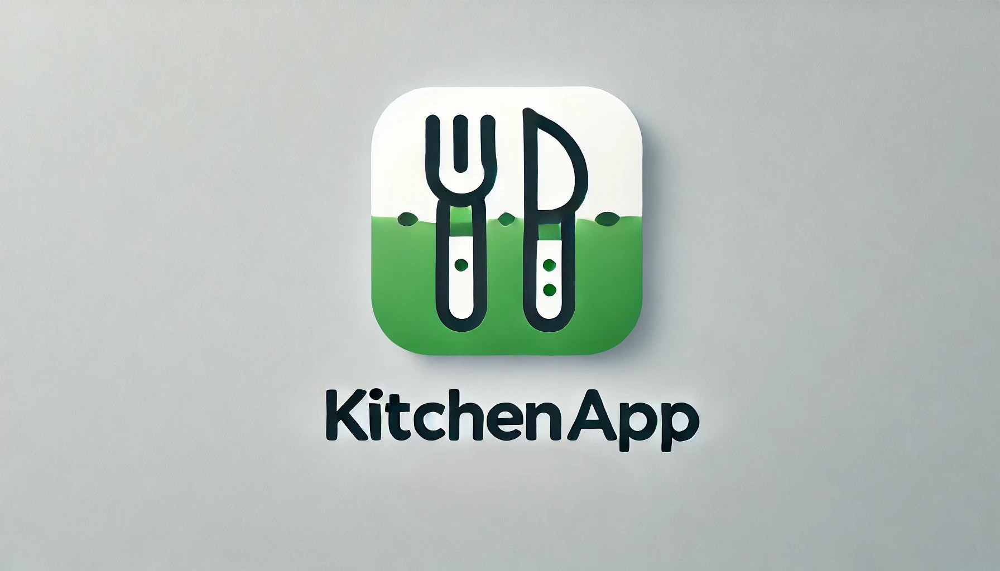

<!-- PROJECT LOGO -->

<br />
<p align="center">
  <a href="https://github.com/frezworx/kitchenapp">
    
  </a>
<br>
<p align="center">
  <a href="https://kitchenapp.onrender.com">
    <span style="color: blue; font-size: 24px; font-weight: bold; text-decoration: underline;">
    CLICK LINK FOR DEMO
    <p align="center" style="font-size: 20px;">
        login: <b>user</b> <br>
        password: <b>user12345</b>
</p>
</span>
  </a>
</p>

<h3 align="center">KitchenApp</h3>

  <p align="center">
    A streamlined solution for consolidating, managing, and analyzing all your kitchen data.
  </p>

## Table of Contents

- [About the Project](#about-the-project)
    - [Key Features](#key-features)
    - [Built With](#built-with)
- [Getting Started](#getting-started)
    - [Prerequisites](#prerequisites)
    - [Installation](#installation)
- [Usage](#usage)
- [Contact](#contact)
- [Acknowledgments](#acknowledgments)

### About the Project

**KitchenApp** is an application designed for managing kitchen-related
information. Its main goal is to simplify the collection, storage, and
processing of data about cooks and dishes in a centralized database. The
interface is intuitive and user-friendly, making it easy to navigate and manage
all aspects of your kitchen operations. Whether you're running a small café or
a large restaurant, **KitchenApp** helps streamline operations, reduce manual
processes, and improve efficiency.

### Key Features

- **Centralized Database**: Store all information about cooks, dishes, and
  related aspects of your kitchen in one place.
- **Intuitive UI**: Easily manage and update data with a user-friendly
  interface.
- **Data Consolidation**: Say goodbye to scattered spreadsheets and manual
  tracking.
- **Scalability**: Suitable for both small cafés and large restaurant chains.

### Built With

- **Backend**: Python, Django
- **Database**: SQLite
- **Frontend**: HTML, CSS, JS
- **Libraries & Tools**: Django ORM, Bootstrap

## Getting Started

To get a local copy up and running, follow the steps below.

### Prerequisites

- Python 3.8+
- Django 3.2+
- Git

### Installation

1. Clone the repository:
   ```sh
   git clone https://github.com/your_username/kitchenapp.git

2. Navigate to the project directory:
   ```sh
   cd kitchenapp

3. Install the required packages:
   ```sh
   pip install -r requirements.txt

4. Apply migrations:
   ```sh
   python manage.py migrate

5. Start the development server:
   ```sh
   python manage.py runserver

6. Open your browser and navigate to:
   ```sh
   http://127.0.0.1:8000/

### Usage

Once KitchenApp is running, you can:

- Add, edit, and remove cooks and dishes.
- Organize recipes and cooking processes.
- Quickly filter and search through data.
- Gain insights into cooking times, dish popularity, and staff performance.
- Use the platform to streamline your workflow, ensure quality control, and
  make data-driven decisions.

### Contact

Vadym aka Frezworx - frezworx@gmail.com

Project Link: https://github.com/frezworx/kitchenapp

### Acknowledgments

- <a href="https://www.djangoproject.com/">Django Documentation</a>
- <a href="https://getbootstrap.com/">Bootstrap</a>
- <a href="https://github.com/othneildrew/Best-README-Template">Othneil Drew's
  Best README Template</a>
